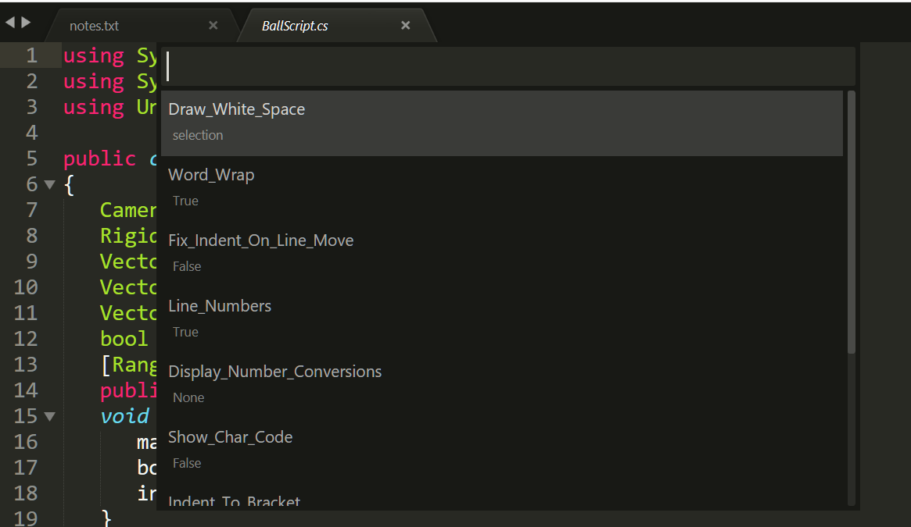
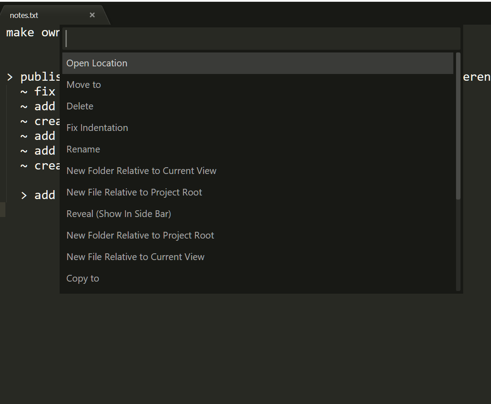
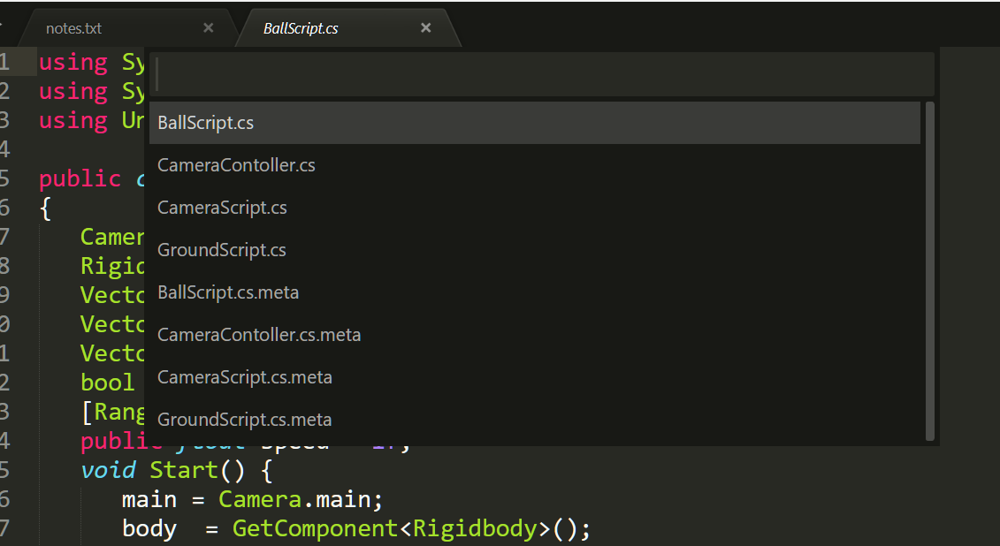
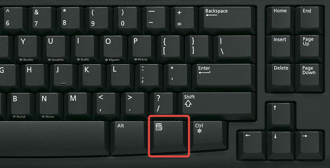

[](https://packagecontrol.io/packages/MenuPenguin)

# Why Use MenuPreferences By Penguin98kStudio

### Toggle Prefrences

> To enable or disable? - the eternal question for not-so-frequent-features


Are you one of those people who wants to enable a popupmenu/statusbar/
some other feature but you don't always use it,
sometimes its annoying but sometimes its really helpful and
enabling or disabling both are frustrating?

Your Saviour (hopefully!) has arrived, with Toggle Preferences,
you can easily temporarily toggle a preference on/off for the current view,
complete the task which needed it,then either let it be toggled till the view
is closed, or easily toggle it off again. Additionaly, the list of preferences
is sorted by usage frequency, so you see your commonly used preferences at the
top. You can easily add/remove preferences in the list by following the guide.
(Menu\Prefrences\PackageSettings\Menu by Penguin\Guide)

I personally often use it for:
- word wrap(can be annoying when using multi-cursor)
- show whitespace (for code formatting)
- plugins which show stuff in statusbar
(enabling too many all the time clutters the statusbar)
- popups (for python coding, Anaconda doc strings popups are really helpful
	when you are not familiar with the functions but really annoying when you
	don't need them)
- my own plugins, mostly plugins which are Event Listeners based.

keyboard shortcut: shift+context_menu

##### Tip for Advanced Users:
use package resource viewer to modify an installed package
so that its command/feature is toggled from a preference
in the settings, I often do that as it really helps

### File Commands
For Active Users of Sublime, we often need to run basic file commands.
The most common being opening the current file directory in the file explorer,
renaming your file, moving, or deleting, or copy etc
to use command pallete, typing some keyword to find your command becomes a bit
slow and annoying. However Now you can simply press context_menu key to see the
relevant commands in a quick panel, with them already sorted according to your
usage. You like to move, rename, make new files (in current directory) often?
Then you will find them right at the top. Also, you can easily add/remove
commands in the list by following the guide
(Menu\Prefrences\PackageSettings\Menu by Penguin\Guide)



Similarly, we often need to open a file in sublime from the current directory
most commonly the same type (example .py when using python), so pressing
ctrl+context_menu neatly opens the file list in quick panel,
with similar extensions listed at the top.



## Getting Started

##### This package has not been properly tested for Linux/Mac environments or Sublime Text 2
##### This package requires the package SideBarEnhancments for it to work properly

The Default Keybindings are:
```json
[
	{ "keys": ["context_menu"], "command": "menu_file_commands" },
	{ "keys": ["shift+context_menu"],	"command": "menu_toggle_preferences"	},
	{ "keys": ["ctrl+context_menu"], "command": "menu_open_from_current_dir" },
]
```
For those unfamilar, this is the key,



the primary reason for using this key is that people rarely use it to open
the default context menu and hence I find it the best to use for our own Menus,
ofcouse you can alter the keybindings if you want.

#### Usage Guide:

- the open from current directory command shows a quick panel of files in the
current directory, with files with same extension as current listed at top,
selecting a file with open it in a new view in sublime
intended use: you are writing a script and you need to quickly open a
related script to view/edit its content

- the file commands menu shows a quick panel to quickly execute any command
related to file,
to add or remove commands please refer to the guide in
(Menu\Prefrences\PackageSettings\Menu by Penguin\Guide)

- the toggle preferences commands menu shows a quick panel to quickly execute
any preference, this toggle is temporary and limited to the current view,
inteded use: for altering preferences for a limited time to help you do a task
example: you might want to temporarily toggle word wrap or show all whitespaces
to add or remove preferences please refer to the guide

Please See the the 'Guide' and 'Settings - Main'
from Menu/Preferences/Menu By Penguin
